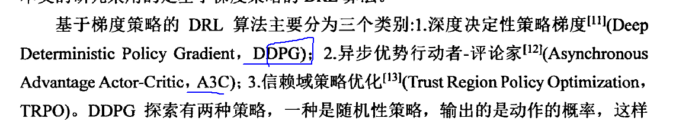
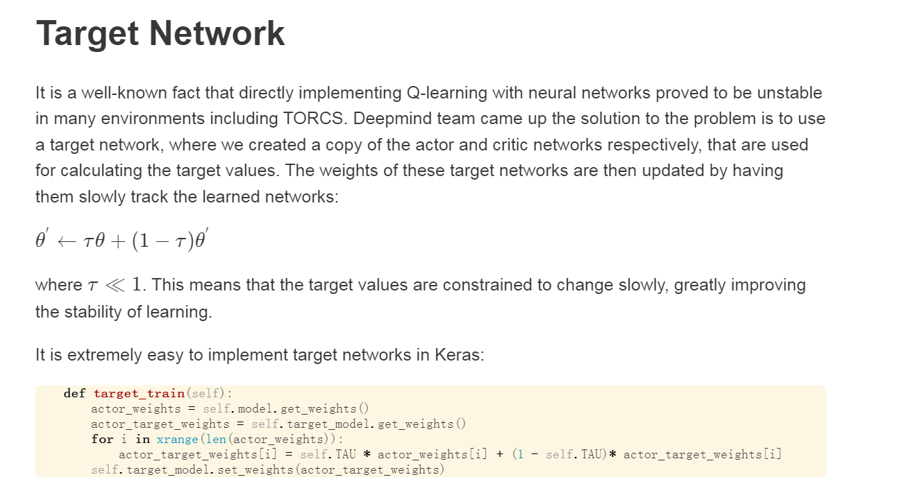

# 强度学习心得

## 未来收益之和Reward概念的理解

强化学习讲究要让我们的每一步action收益(reward)最大，这里的reward是针对于未来说的。我现在还不知道未来的情况是啥，但是我需要计算从我现在这一步St到我结束的全部受益。

G_{t}(s)=R_{t+1} + \gamma R_{t+2} + \gamma ^{2}  R_{t+2} + \cdots +\gamma ^{T-1}  R_{T}

## 马尔科夫决策中的名词解释
[如何理解Q(s,a)和V(s)](https://zhuanlan.zhihu.com/p/109498587)

## 函数更新策略
> MC算法和TD算法

[参考博客](https://zhuanlan.zhihu.com/p/94464246)

### MC 算法

MC的核心思想就是大数定理中，样本的平均值等于期望值

因为强化学习大部分是model free的，即我们不知道状态转移概率和具体价值。所以我们主要目的就是通过一个策略去最大化求E(Q(s,a))。

mc提出，如果我们在采样数足够大 **(在或者不再同一个eposide)** 的情况下，总是能碰到相同的情况，即相同的状态S。

所以 V(s)可以近似为所有采样中 V(s)的平均值

所以如参考博客上面讲的那样，最后的Q(s,a) = Q(s,a) + 1/k **(当前所有相同样本的个数)** (G(t) - Q(s,a))

> 在实际代码中，MC是在每一个eposide 更新一次，和后面的PG算法差不多

### TD算法

TD算法是MC算法的一次优化，公式区别如上图所示，其中他R(t+1)是St(A=at)的回报。MC算法是因为需要知道G(t)的值，所以需要整个eposide才能进行参数更新。
而td算法则表示，只要知道到达下一个状态的reward值和下一个状态的V就可以完成一次参数更新。

## 名词解释

**advantage function**：Usually denoted as A(s,a), the Advantage function is a measure of how much is a certain action a good or bad decision given a certain state

## 常见的算法

## DQN network

Bellman方程

### 为什么DQN需要两个网络
[参考链接](https://ai.stackexchange.com/questions/22504/why-do-we-need-target-network-in-deep-q-learning)

之前一直有一个疑问就是为什么不能直接一个网络来完成TD方法的更新？

DQN的核心公式是：(rt+maxaQ(st+1,a;θ−)−Q(st,at;θ))2 ，其中θ- 是来自Target Network里面的，这样是为了让Action网络去暂时的去接近这个Target网络，来保证自己可以在迭代C次之间逐步找到一个最优解。

> 但是如果我就只用一个网络去做呢？？

也就是说都用θ来更新，这样会使得网络变得不稳定，不知道网络去哪里优化，因为它的最优解目标一直在变。

上面的那个参考博客说的很好，就像一个狗在尝试转圈咬到自己的尾巴一样。

### 解决Target Network更新问题

## AC算法

## DDPG算法

